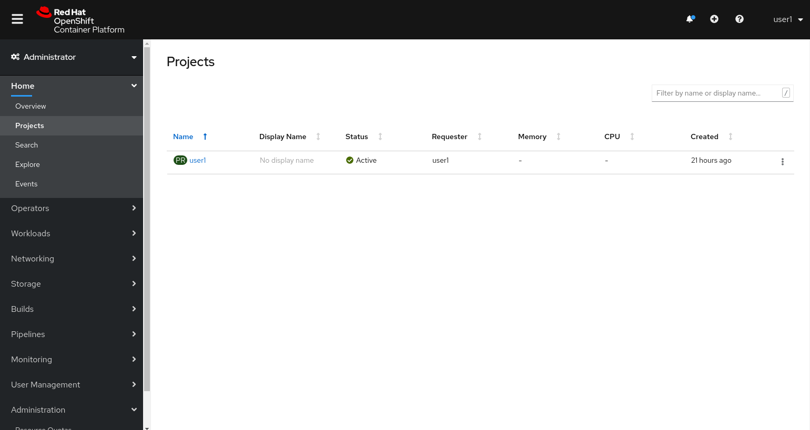
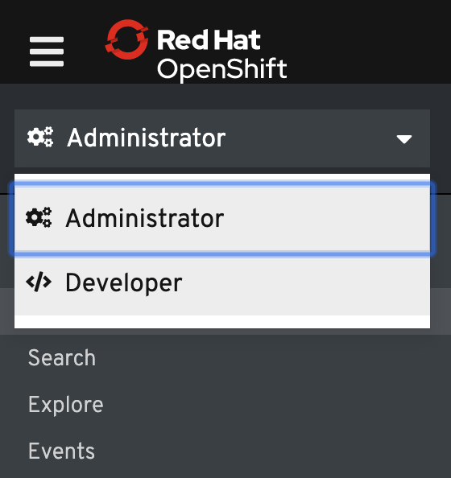
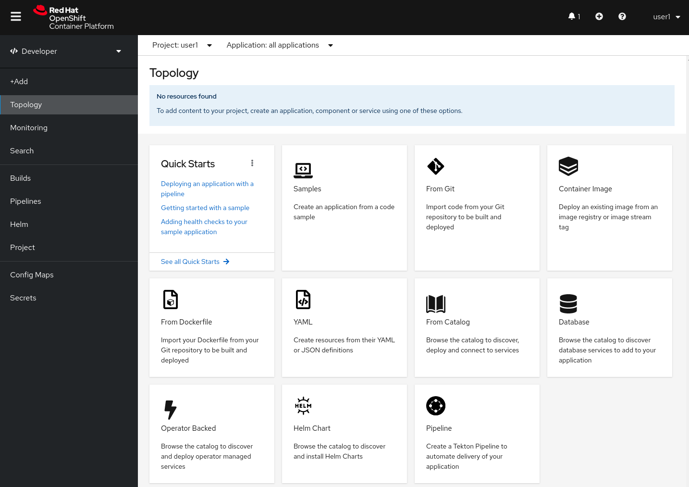
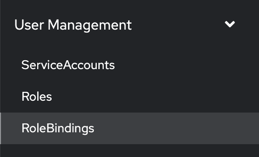
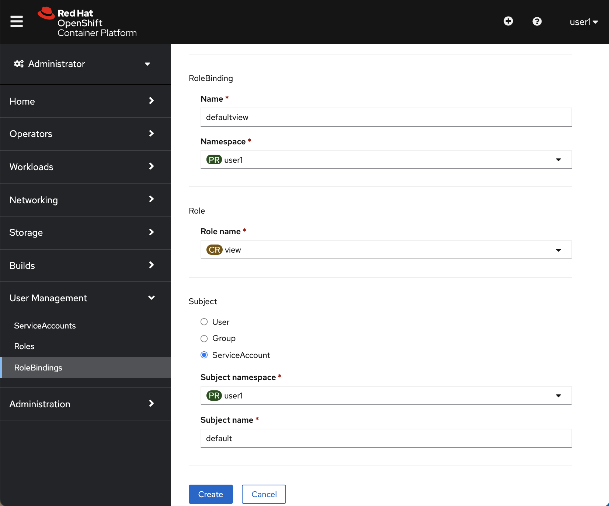

## Logging in to OpenShift

odo is a fast, iterative, and straightforward CLI tool for developers who write, build, and deploy applications on Kubernetes and OpenShift. Before we get started, you need to log in to OpenShift. In this lab enviroment, the odo CLI has already been installed for you.

In this lab environment, you already have access to single project with your assigned user e.g. `userX`.

You user is automatically logged to OpenShift with oc CLI:

[source,bash,role=execute-1]
----
oc whoami
----

A Project has been already assigned to you to work with:

[source,bash,role=execute-1]
----
oc project -q
----

## OpenShift Web Console

To get a feel for how the web console works, get Web Console link from this command output:

[source,bash,role=execute-1]
----
echo https://console-openshift-console.$CLUSTER_SUBDOMAIN/k8s/cluster/projects
----

Copy the URL that you get from the command line and open it in a Browser.

On the login screen, enter your credentials:

Username: `userX`

Password: `openshift`

The first time you access the web console, you will most likely be in the Administrator perspective. You will be presented with the list of Projects that you can access, and you will see something that looks like the following image:

Click on the project you see listed. When you click on it, you will be taken to the project details page,
which will list some metrics and details about your project. There's nothing there now, but that will change as you progress through the lab.

image::images/explore-webconsole2.png[Explore Project]

At the top of the left navigation menu, you can toggle between the Administrator perspective and the Developer perspective.

Select *Developer* to switch to the Developer perspective. Once the Developer perspective loads, you should be in the *Topology* view. Right now, there are no applications or components to view, but once you begin working on the lab, you'll be able to visualize and interact with the components in your application here.

We will be using a mix of command line tooling and the web console for the labs.

## Creating a Service account

The backend of our application uses the OpenShift REST API. In order for the backend to access the API, we need to grant access to the service account that the backend is using. We will do this in the web console.

On the left side of the console, click the *User Management* tab and select the *RoleBindings* option as shown below:

On the *RoleBindings* page, click the *Create Binding* button and fill out the wizard with the information shown below:

Feel free to copy the information for the role binding name and service account subject name below:

Role Binding Name: `defaultview`

Subject Name: `default`

Alternatively, this step can be completed via the command line by running:

[source,bash,role=execute-1]
----
oc adm policy add-role-to-user view --rolebinding-name=defaultview -z default
----

The default service account provided to the backend container will now have **view** access, allowing it can retrieve objects via the API. Note that you could choose to grant access to the *edit* role instead. Providing **edit** access would allow the backend to view, modify, or delete objects. Enabling this level of access allows the backend to destroy non-recoverable resources that are used to host the game (breaking the user-experience for app users) - which is why we are using **view** access for this scenario.