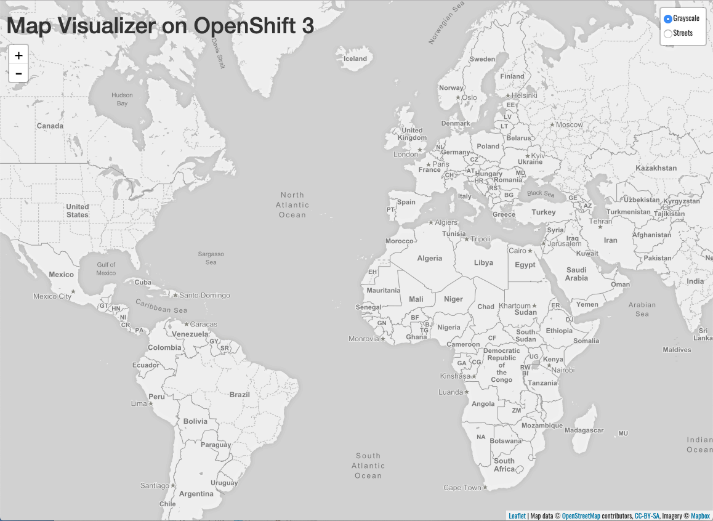

We have deployed our sample application's frontend component. While this component exposes 3 different ports, we need to explicitly define that 8080 is the one we want for our external access. Let's create an external URL for our application so we can see it in action:

```execute-1
odo url create frontend --port 8080
```

Similar to when we create a component, creating a URL sets that information in the component configuration, but it doesn't get applied to your OpenShift cluster until you run `odo push`.

```execute-1
odo push --show-log
```

As the `odo push` is executing, watch the logs in the lower terminal and wait until the component is ready by running the following:

```execute-2
cd ~/frontend
odo log -f
```

In the upper terminal you should see:

```
Validation
 ✓  Checking component [28ms]

Configuration changes
 ✓  Retrieving component data [25ms]
 ✓  Applying configuration [52s]

Applying URL changes
 ✓  URL frontend: http://frontend-parksmap-odo-93101.apps.example.com created

Pushing to component frontend of type binary
 ✓  Checking file changes for pushing [4ms]
 ✓  No file changes detected, skipping build. Use the '-f' flag to force the build.
```

In the lower terminal, you're looking for a message like this:

```
2019-04-26 23:55:05.355  INFO 752 --- [           main] c.o.evg.roadshow.ParksMapApplication
  : Started ParksMapApplication in 5.261 seconds (JVM running for 5.853)
```

Once you see that, execute `ctrl+c`

```execute-2
<ctrl+c>
```

The URL created for the application will be displayed in the output of the `odo push` command. Visit the URL in your web browser to view the application.

http://frontend-parksmap-%project_namespace%.%cluster_subdomain%

__NOTE__: When you don't specify a name for the URL to be created, it will default to the name of the component and port, e.g. ``http://frontend-8080-parksmap-%project_namespace%.%cluster_subdomain%``


