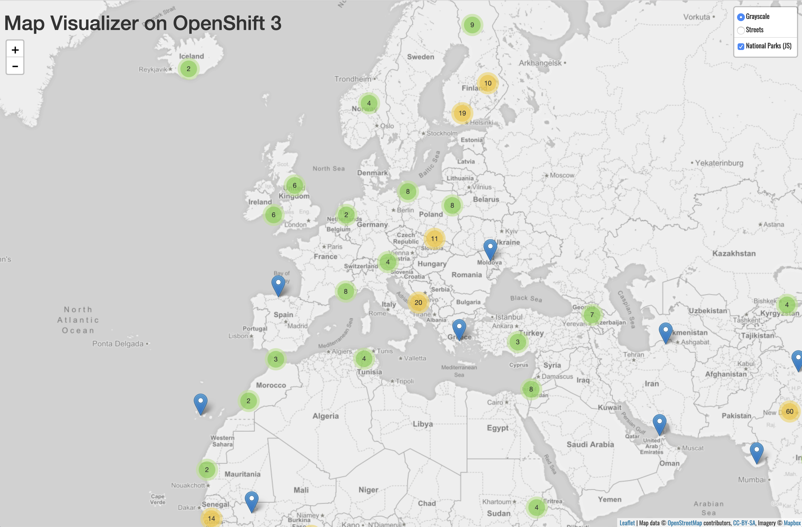

With both components of our application running on the cluster, we need to connect them so they can communicate. OpenShift provides mechanisms to publish communication bindings from a program to its clients. This is referred to as linking.

To link the current ``frontend`` component to the ``backend``, you can run:

```execute-1
odo link backend --component frontend --port 8080
```

__NOTE__: Here we have explicitly provided the component to which the link should happen although it's not needed. It's only there for teaching purposes.

This will inject configuration into the frontend about the backend and restart the frontend.

Now, re-push the component:

```execute-1
odo push
```

You can check the the startup logs:

```execute-1
odo log -f
```

Hit:

```execute-1
<ctrl+c>
```

in the terminal to stop tailing the logs.

Once the component has successfully been re-deployed you can see the changes in the map URL:

http://frontend-parksmap-%project_namespace%.%cluster_subdomain%

You should now see a nice map showing where you can find national parks.


